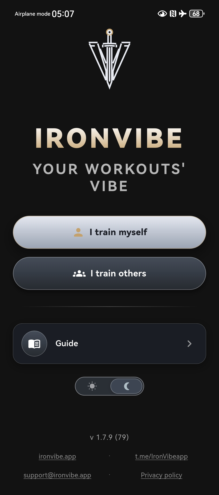
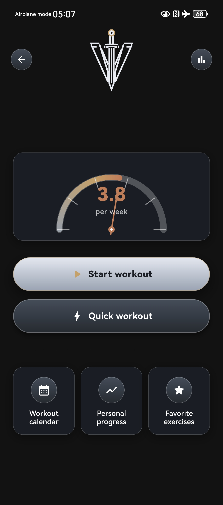
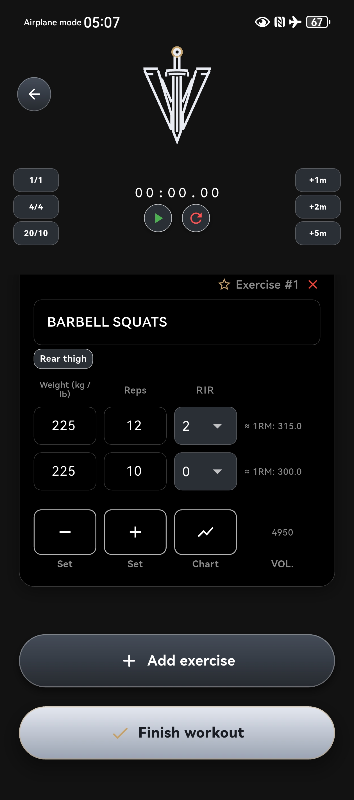
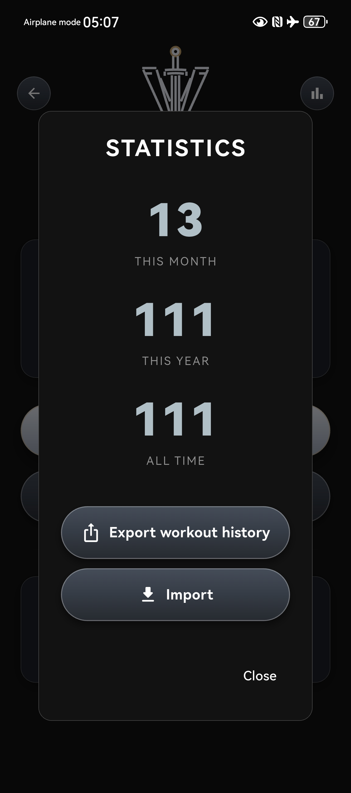

<p align="center">
  
</p>

<h1 align="center">IronVibe</h1>

<p align="center">
  <strong>Your workouts. Your rules. Offline-first.</strong><br />
  No accounts. No ads. No subscriptions.
</p>

<p align="center">
  <a href="https://ironvibe.app"></a>
  <a href="https://play.google.com/store/apps/details?id=com.ironvibe.app"></a>
  
  
</p>

<p align="center">
  <a href="https://ironvibe.app">Website</a> ·
  <a href="https://play.google.com/store/apps/details?id=com.ironvibe.app">Google Play</a> ·
  <a href="https://ironvibe.app/privacy/">Privacy</a> ·
  <a href="Flutter/">Source</a>
</p>

<p align="center">
  
  
  
  
</p>

## Why this repo is public

IronVibe is a training log that lives on your phone. We publish the full Flutter source so anyone can see what the app does: how workouts are stored, what leaves the device, and what does not.

The marketing site is in this same repository, in a separate tree from the app, and is what [ironvibe.app](https://ironvibe.app) serves.

## Repository layout

```text
Flutter/             App source (Android-first)
en/, ru/, …          Localized website pages
theme.css, *.js      Shared site styles and scripts
screenshots/         Light / dark UI captures
IronVibe-release.apk Sideload APK for the website download button
```

| | App | Website |
| --- | --- | --- |
| Path | [`Flutter/`](Flutter/) | locale folders + root static files |
| Stack | Flutter / Dart | Static HTML, CSS, JS |
| Hosting | Google Play + sideload APK | GitHub Pages → ironvibe.app |

GitHub Pages is configured **not** to publish `Flutter/` as part of the website.

## App

Minimal workout tracker for athletes and coaches:

- Trainee and trainer modes
- History, personal progress, rest timer
- Local storage only — uninstalling the app removes the data
- CSV export / import if you want a copy elsewhere

```bash
cd Flutter
flutter pub get
flutter run
```

Current version: **1.7.5** (`1.7.5+75`). Release builds: see [`Flutter/BUILD_AAB.md`](Flutter/BUILD_AAB.md). Signing keys stay on the maintainer machine; they are not in git.

## Website

The live site is a static multilingual landing page (EN, RU, AR, DE, ES, FR, HI, IT, PT, ZH), plus privacy and donate pages. No accounts, no server-side forms.

## License

[MIT](LICENSE). Use the code; keep the copyright notice.

Questions: [support@ironvibe.app](mailto:support@ironvibe.app)
